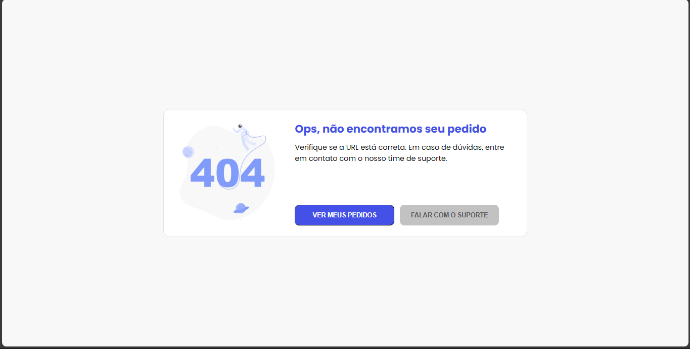

# API Python com Websockets

Uma API que faz o uso de notificações em tempo real com protocolo Websocket e também Flask_socketIO para fazer a confirmação de um pagamento em tempo real

  <a href="#-tecnologias">Tecnologias</a>

 

  
  
  

## 🚀 Tecnologias

Esse projeto foi desenvolvido com as seguintes tecnologias:

- Python
- Flask
- Websocket
- Qrcode
- HTML
- CSS
